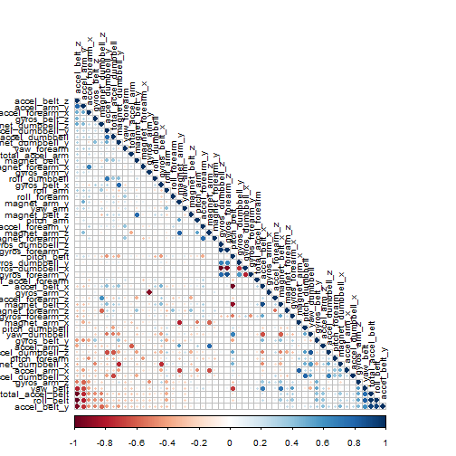

#-------------------------------------------------------------------------------
### Author : Arun Kumar Madas
### Date   : 04/26/2015
### Course : Practical Machine Learning - Project
#-------------------------------------------------------------------------------

# Executive Summary
Using devices such as Jawbone Up, Nike FuelBand, and Fitbit it is now possible to collect a large amount of data about personal activity relatively inexpensively. These type of devices are part of the quantified self movement - a group of enthusiasts who take measurements about themselves regularly to improve their health, to find patterns in their behavior, or because they are tech geeks. One thing that people regularly do is quantify how much of a particular activity they do, but they rarely quantify how well they do it. In this project, your goal will be to use data from accelerometers on the belt, forearm, arm, and dumbell of 6 participants. They were asked to perform barbell lifts correctly and incorrectly in 5 different ways. More information is available from the website here: http://groupware.les.inf.puc-rio.br/har (see the section on the Weight Lifting Exercise Dataset). 

The goal of this project is to predict the manner in which they did the exercise. This is the "classe" variable in the training set. we may use any of the other variables to predict with. 

# Libraries

The following libraries were used throughout the code.


```r
library(caret)
library(corrplot)
library(kernlab)
library(knitr)
library(randomForest)
opts_chunk$set(cache = FALSE)
```

# Loading and preprocessing the data

Download the provided training and test data sets into working directory (two csv files)


```r
# file URL and destination file
train_url <- "https://d396qusza40orc.cloudfront.net/predmachlearn/pml-training.csv"
test_url <- "https://d396qusza40orc.cloudfront.net/predmachlearn/pml-testing.csv"

# #sets to use internet intended to use for downloading data file
setInternet2(use = TRUE)
setwd("C:/Arun/docs/dsc_jhu/8_Practical_Machine_Learning/courseproj")
download.file(train_url, destfile = "./pml-training.csv")
download.file(test_url, destfile = "./pml-testing.csv")
```

Load the Data


```r
# read the csv file for training 
training_data <- read.csv("pml-training.csv", na.strings= c("NA",""," "))
```

Exclude possible NA values and empty/white spaces. 
The first eight columns that acted as identifiers for the experiment were also removed.


```r
# clean the data by removing columns with NAs etc
training_data_NAs <- apply(training_data, 2, function(x) {sum(is.na(x))})
training_data_clean <- training_data[,which(training_data_NAs == 0)]

# remove identifier columns such as name, timestamps etc
training_data_clean <- training_data_clean[8:length(training_data_clean)]
```

# Creating a model

The test data set was split up into training and cross validation sets in a 70:30 ratio in order to train the model and then test it against data it was not specifically fitted to.


```r
# split the cleaned testing data into training and cross validation
inTrain <- createDataPartition(y = training_data_clean$classe, p = 0.7, list = FALSE)
training <- training_data_clean[inTrain, ]
crossval <- training_data_clean[-inTrain, ]
```

A random forest model was selected to predict the classification because it has methods for balancing error in class population unbalanced data sets. The correlation between any two trees in the forest increases the forest error rate. Therefore, a correllation plot was produced in order to see how strong the variables relationships are with each other.


```r
# plot a correlation matrix
correlMatrix <- cor(training[, -length(training)])
corrplot(correlMatrix, order = "FPC", method = "circle", type = "lower", tl.cex = 0.8,  tl.col = rgb(0, 0, 0))
```

 

In this type of plot the dark red and blue colours indicate a highly negative and positive relationship respectively between the variables. There isn't much concern for highly correlated predictors which means that all of them can be included in the model.

Then a model was fitted with the outcome set to the training class and all the other variables used to predict.


```r
# fit a model to predict the classe using everything else as a predictor
model <- randomForest(classe ~ ., data = training)
model
```

```
## 
## Call:
##  randomForest(formula = classe ~ ., data = training) 
##                Type of random forest: classification
##                      Number of trees: 500
## No. of variables tried at each split: 7
## 
##         OOB estimate of  error rate: 0.52%
## Confusion matrix:
##      A    B    C    D    E  class.error
## A 3903    2    0    0    1 0.0007680492
## B   16 2637    5    0    0 0.0079006772
## C    0   11 2383    2    0 0.0054257095
## D    0    0   25 2224    3 0.0124333925
## E    0    0    1    5 2519 0.0023762376
```

The model produced a very small OOB error rate of .56%. This was deemed satisfactory enough to progress the testing.

# Cross-validation

The model was then used to classify the remaining 30% of data. The results were placed in a confusion matrix along with the actual classifications in order to determine the accuracy of the model.


```r
# crossvalidate the model using the remaining 30% of data
predictCrossVal <- predict(model, crossval)
confusionMatrix(crossval$classe, predictCrossVal)
```

```
## Confusion Matrix and Statistics
## 
##           Reference
## Prediction    A    B    C    D    E
##          A 1672    2    0    0    0
##          B    7 1130    2    0    0
##          C    0    3 1022    1    0
##          D    0    0   15  949    0
##          E    0    0    0    3 1079
## 
## Overall Statistics
##                                           
##                Accuracy : 0.9944          
##                  95% CI : (0.9921, 0.9961)
##     No Information Rate : 0.2853          
##     P-Value [Acc > NIR] : < 2.2e-16       
##                                           
##                   Kappa : 0.9929          
##  Mcnemar's Test P-Value : NA              
## 
## Statistics by Class:
## 
##                      Class: A Class: B Class: C Class: D Class: E
## Sensitivity            0.9958   0.9956   0.9836   0.9958   1.0000
## Specificity            0.9995   0.9981   0.9992   0.9970   0.9994
## Pos Pred Value         0.9988   0.9921   0.9961   0.9844   0.9972
## Neg Pred Value         0.9983   0.9989   0.9965   0.9992   1.0000
## Prevalence             0.2853   0.1929   0.1766   0.1619   0.1833
## Detection Rate         0.2841   0.1920   0.1737   0.1613   0.1833
## Detection Prevalence   0.2845   0.1935   0.1743   0.1638   0.1839
## Balanced Accuracy      0.9977   0.9968   0.9914   0.9964   0.9997
```

This model yielded a 99.3% prediction accuracy. Again, this model proved very robust and adequete to predict new data.

# Predictions

Read the data set freshly again. The model was then used to predict the classifications of the 20 results of this newly read data.


```r
# apply the same treatment to the final testing data
test_data <- read.csv("./pml-testing.csv", na.strings= c("NA",""," "))
test_data_NAs <- apply(test_data, 2, function(x) {sum(is.na(x))})
test_data_clean <- test_data[,which(test_data_NAs == 0)]
test_data_clean <- test_data_clean[8:length(test_data_clean)]

# predict the classes of the test set
predictTest <- predict(model, test_data_clean)
predictTest
```

```
##  1  2  3  4  5  6  7  8  9 10 11 12 13 14 15 16 17 18 19 20 
##  B  A  B  A  A  E  D  B  A  A  B  C  B  A  E  E  A  B  B  B 
## Levels: A B C D E
```

# Conclusions

Since there is a lot of information given from multiple measuring instruments, its now possible to accurately predict how well a person is doing excercise with a simple model.
